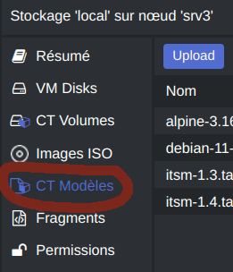
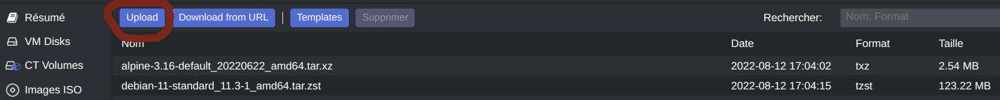
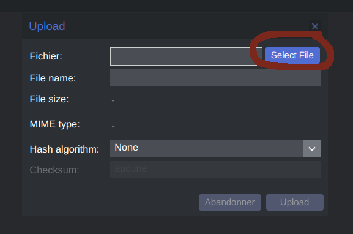
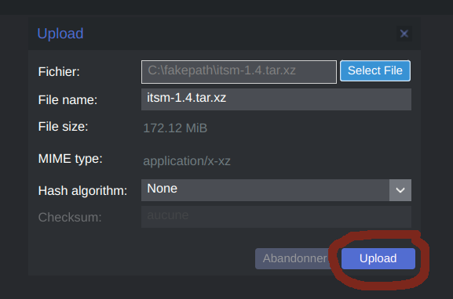

# ITSM-NG LXC template

LXC is a userspace interface for the Linux kernel containment features. Through a powerful API and simple tools, it lets Linux users easily create and manage system or application containers.

You will find more information at this link : [LXC > Introduction](https://linuxcontainers.org/lxc/introduction/)

## Requirement

Distrobuilder is required to build ITSM-NG LXC template.

The installation guide is available [here](https://github.com/lxc/distrobuilder#installing-from-source).

## Build LXC Image

To build ITSM-NG LXC template, clone the repo and follow the next documentation.

	$ git clone https://github.com/itsmng/itsm-lxc
	$ cd itsm-lxc

The next command line need to be launch with root permission :

	$ sudo distrobuilder build-lxc ubuntu.yaml

Now, ITSM-NG LXC image has been builded with name `rootfs.tar.xz`.

It's possible to rename the image with the next command :
		
	$ mv rootfs.tar.xz itsmng-VERSION.tar.xz

### Change ITSM-NG version

If you want to build an ITSM-NG LXC template with an other ITSM-NG version, edit the `ubuntu.yaml` file and set the version as you want :
	
	# line 278: VERSION=1.4.0
	$ vi ubuntu.yaml

## Install LXC template in Proxmox

To install ITSM-NG LXC template on Proxmox, follow the next steps :

* Select the LXC template storage.

* Click on `CT Modeles`.

* Click on `Upload`.

* Click on `Select File` and select the LXC template

* Click on `Upload`

